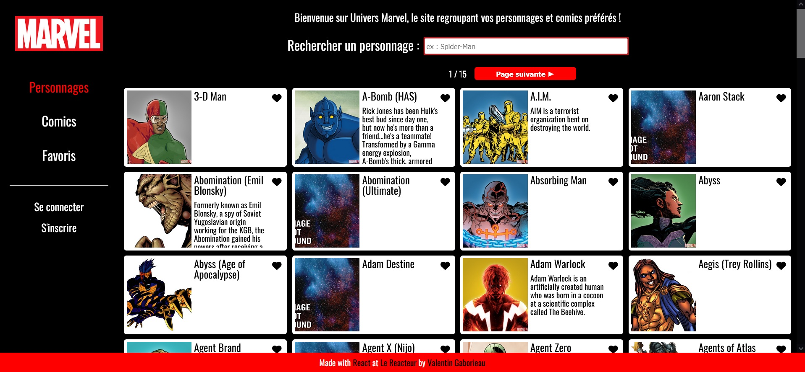
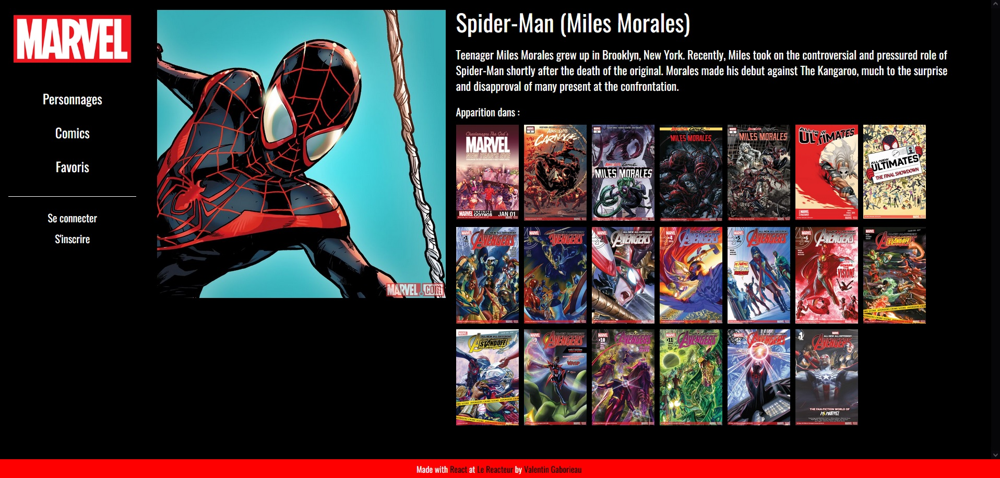
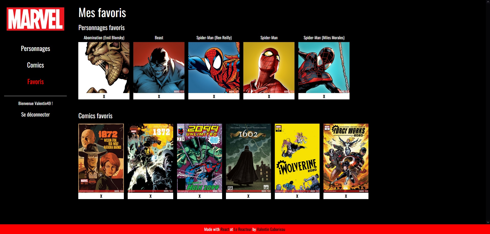

# Marvel Front

 : <a href="https://silly-sprite-bccc62.netlify.app/" target="_blank">https://silly-sprite-bccc62.netlify.app/</a>

A responsive site made with React on the Marvel universe. All data is provided by an API.

## Features

- Search input and pagination
- Sign Up and Sign In
- Add or remove character or comics from the favorites

## Available Scripts

You can clone this project with the command line 'git clone', install dependencies with "yarn" and you can run :

### `yarn start`

Runs the app in the development mode.\
Open [http://localhost:3000](http://localhost:3000) to view it in your browser.

The page will reload when you make changes.\
You may also see any lint errors in the console.
